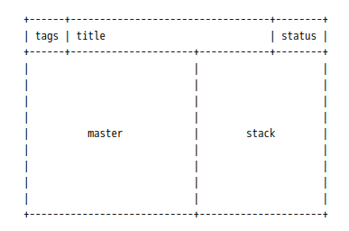

# dwl 版本

更新最新代码 `1002ea04`(24-6-26 at 下午12:22)，描述：`add bugref about why we call updatemons in outputmgrapplyortest`

# 安装

## 下载

```shell
sudo pacman -S libinput wayland wlroots wayland-protocols pkg-config
```

## 构建 `dwl`

```shell
sudo make install
```




# 已打补丁
- bar
- attachbottom
- autostart
- barpadding
- setupenv
- hide_vacant_tags
- numlock-capslock
- pertag
- gaps
- hide-behind-fullscree